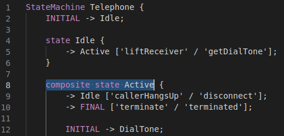

# State-Machines
Python implementation of simplified State Machines. Uses ANTLR4 for parsing.

## Dependencies

- [gevent](https://pypi.org/project/gevent/)
- [BSON-RPC](https://pypi.org/project/bsonrpc/)
- [ANTLR4 Runtime](https://pypi.org/project/antlr4-python3-runtime/)

## Launching Runtime

Requirements:
- [Python](https://www.python.org/) version 3.10 or higher
- [venv](https://docs.python.org/3/library/venv.html#module-venv)

In a terminal, go tho the root of this project.

First, we need to set up a virtual environment for this project. For this, make sure you have the `venv` Python module installed. On Linux system, this module can be installed with the command: `sudo apt install python<version>-venv`

\<version\> is the version of Python installed on your machine, for instance 3.10. For more information about virtual environments for Python, visit the link given in the **Requirements**.

To create the virtual environment, execute the command: `python3 -m venv .venv`

This environment must be activated in order to install the dependencies and launch the runtime. Activating the virtual environment is done through the command: `source .venv/bin/activate`

Finally, to install the dependencies, execute the command: `pip install -r requirements.txt`

To start the runtime, execute the commmand: `python3 src/__main__.py <port>`

\<port\> is the port at which the server should listen. Note that this server only runs on localhost.

You can stop the runtime by pressing `Ctrl + C` in the terminal. To deactivate the virtual environment, execute the command: `deactivate`

## Domain-Specific Breakpoints

This runtime supports domain-specific breakpoints that are put either on transitions or states.

### Breakpoint Location

The accepted location for a breakpoint on a transition is as follows:

The accepted location for a breakpoint on a state (either simple or composite) is as follows:

### Breakpoint Semantics

The semantics of the available breakpoint types related to transitions are:

- **Transition Fired**: Breaks when a specific transition is fired.

The semantics of the available breakpoint types related to states are:

- **State Reached**: Breaks when a specific state is about to be reached.
- **State Exited**: Breaks when a specific state is about to be exited.